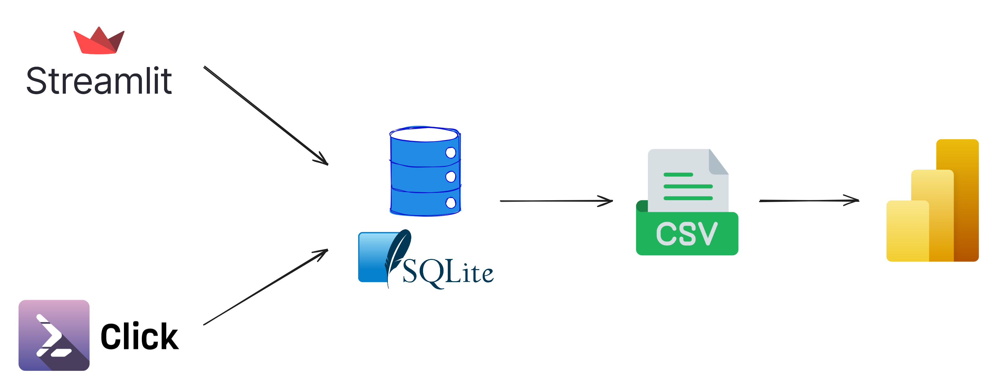

# Movie manager
A movie manager web app, with CLI support.

Story: I originally tracked my movie-watching journey in Notion (web). However, adding new movies to Notion was painful, and once I had more than 100 movies, it became laggy 🙂.
So I built this movie manager as a more convenient way to manage my movie collection.

## Features
- Full CRUD support
- Track essential metadata: `name`, `year`, `status`, `type`, `country`, `genres`, `rating`, `watched_date`, `note`
- Interactive dashboard with Power BI (Streamlit charts are limited and less interactive compared to Power BI)
- CLI to add, filter, and analyze movie data
  - Fast CLI experience by lazy importing
  - Run SQL script in `sql/` folder, provide flexibility and customization
- Backup and Restore functionality (CLI)
- Testing functionalities

## Tech stack
- Web UI: Streamlit
- Database: SQLite + CSV file (for Power BI dashboard)
- Visualization: Power BI
- CLI: Click + Rich
- Testing: Pytest

## Architecture


## ERD


For schema detail, see [schema.sql](/sql/schema.sql)

## A glimpse
**Web interface**


**Dashboard**


## Notes
- `kdrama` = `series` + `Korea` (similarly, `cdrama` = `series` + `China`)
- `anime` = `animation` + `Japan`
- `romcom` = `romance` + `comedy`
- For privacy reasons, all notes were removed from the database.
- Remember to refresh all tables to get the latest data in the Power BI report (`dashboard.pbix`).
- `rich.Table` is bad at handling clickable links, so it is recommended to view notes in the web app or using `get` command in CLI.
- Adding multiline notes in CLI is limited, `click.prompt()` just accepts a single-line prompt string, use the web app instead.
- The CLI `update` command is intended for editing existing field values, not for clearing them. To remove a field’s content, use the web app instead.
- The CLI `add`/`update` command cannot add/update new country, use the web app instead.

## Recent updates
- `v0.3.1` - Improved CLI, added testing
- `v0.3.0` - Major CLI upgrades with new commands, SQL-based filtering, improved sorting, new utilities, and performance refinements
- `v0.2.0` - Data stored in SQLite database instead of CSV, faster experience, CLI now has more functionality and can run SQL scripts
- `v0.1.3` - Added backup/restore, rating filter, and refinements to CLI
- `v0.1.2` - Improved CLI
- `v0.1.1` - Added small CLI
- `v0.1.0` - Data stored in a CSV file

See full details in the [CHANGELOG](/CHANGELOG.md).

## Usage
- Install [uv](https://docs.astral.sh/uv/) (recommended for package management)
- Create a virtual environment
```
uv venv
```
- Activate the virtual environment
- Sync dependencies
```
uv sync --no-dev
```
- Or sync dependencies with CLI support (recommended)
```
uv sync --extra cli
```
- Run the app
```
streamlit run app.py
```
- Run the CLI (if installed with `--extra cli`):
```
py cli.py
```
```
Usage: cli.py [OPTIONS] COMMAND [ARGS]...

  Command-line tool to manage, filter, and analyze your movie collection.

Options:
  -h, --help  Show this message and exit.

Commands:
  add       Add a new movie interactively.
  backup    Back up data.
  delete    Delete a movie by id.
  filter    Filter movies by attributes.
  get       Get information of a movie by id.
  latest    Show latest added movies.
  optimize  Optimize the SQLite database using VACUUM.
  recent    Show recently watched movies.
  restore   Restore data from backup.
  search    Search movies by keyword.
  sql       Run a SQL file from the 'sql/' folder.
  stats     Show statistics for the movie data.
  update    Update a movie interactively by id.
```

## Development
- Install development dependencies (testing)
```
uv sync --dev
```

- Run tests
```
uv run pytest
```

#### Happy watching 😄. But remember that movies are also a form of escapism 😢.